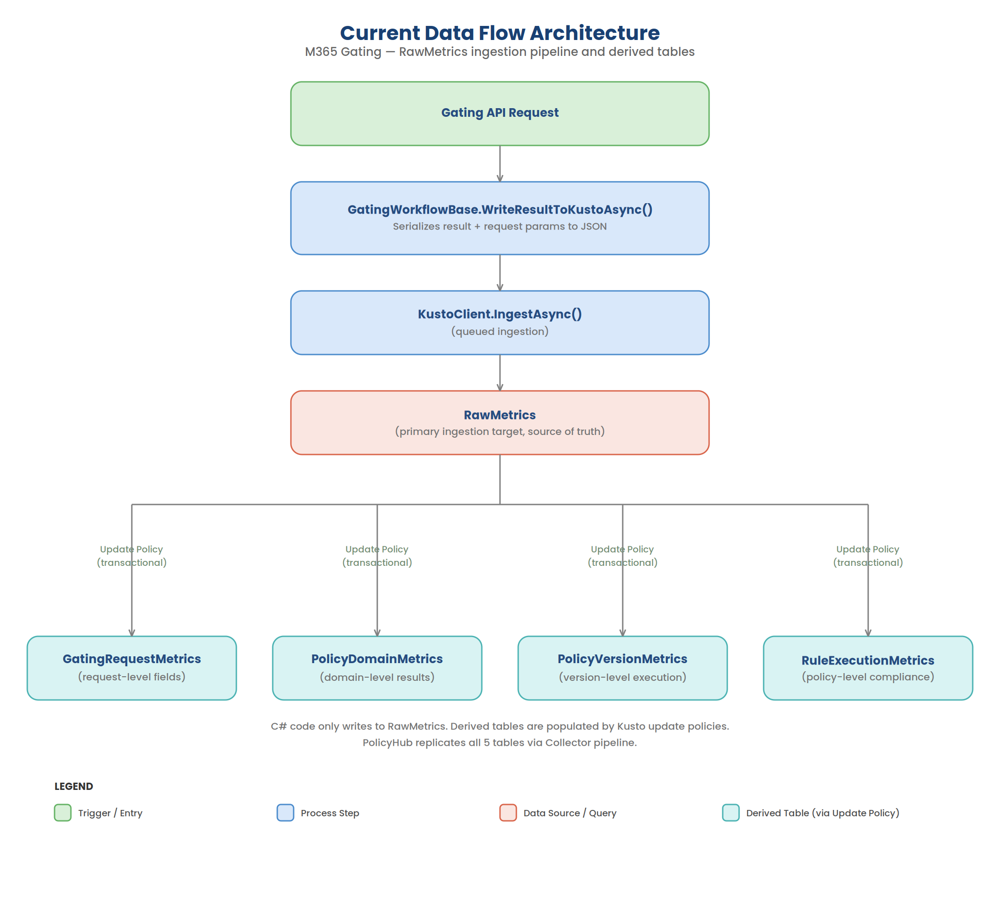
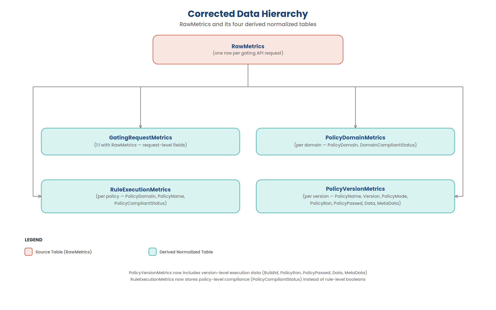
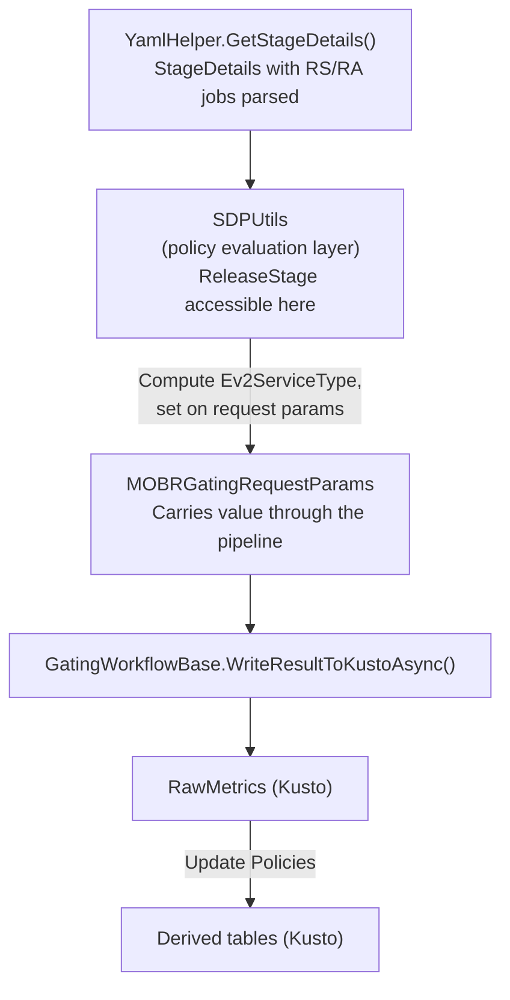
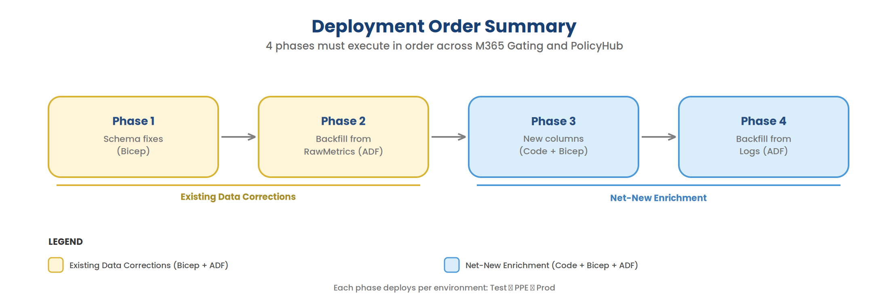

# Enriching Gating Normalized (Derived) Kusto Tables

This document describes the full plan to restructure and enrich the M365 Gating Kusto normalized tables to support SDP compliance dashboards and stage-level analytics. It covers schema corrections, new column additions, backfill strategy, and propagation to PolicyHub.

---

## Table of Contents

1. [Background](#background)
2. [Current Architecture](#current-architecture)
3. [Problems with Current Schema](#problems-with-current-schema)
4. [Phase 1: Fix Normalized Table Schemas](#phase-1-fix-normalized-table-schemas)
5. [Phase 2: Backfill Derived Tables from RawMetrics via ADF](#phase-2-backfill-derived-tables-from-rawmetrics-via-adf)
6. [Phase 3: Add Net-New Enrichment Columns](#phase-3-add-net-new-enrichment-columns)
7. [Phase 4: Backfill Enrichment Columns from Logs via ADF](#phase-4-backfill-enrichment-columns-from-logs-via-adf)
8. [Propagation to PolicyHub](#propagation-to-policyhub)
9. [Deployment Order Summary](#deployment-order-summary)
10. [Reference: Data Volumes](#reference-data-volumes)
11. [Reference: Source Queries](#reference-source-queries)

---

## Background

The SDP Compliance dashboards (`Sdp-Compliance-Queries/Queries/`) currently derive stage-level enrichment columns (Ring, Trainset, DeploymentType, Namespace, Cosmic status, EV2 service type, per-policy compliance) by joining across multiple external data sources (`TimelineRecords`, `Logs`, `BuildYamlSnapshot`, etc.) at query time. This is expensive and fragile.

The M365 Gating service already receives most of these values as request parameters and produces detailed per-policy results in `RawGatingResult`. By:
1. Fixing the normalized table schemas to correctly represent the data hierarchy
2. Adding missing enrichment columns at ingestion time
3. Backfilling historical data from `RawMetrics`

...we can eliminate complex joins in downstream queries and provide accurate, pre-computed analytics tables.

---

## Current Architecture

### Data Flow



The C# code **only writes to `RawMetrics`**. The 4 derived tables are populated automatically by Kusto update policies — KQL queries that run on each ingested row and insert transformed results into the target tables.

PolicyHub then **replicates** all 5 tables from M365 Gating Kusto (`M365GatingAnalytics`) into its own Kusto (`PolicyHubAnalytics`) via a Collector pipeline.

### RawGatingResult Hierarchy

The `RawGatingResult` dynamic column in `RawMetrics` contains the full nested policy evaluation result:

```
RawGatingResult
├── CompliantStatus                          (overall: Compliant/NotCompliant/CompliantWithRemediation)
├── DomainResults[]                          (V2 structure — versioned policies)
│   ├── PolicyDomain                         (SafeDeploymentPolicies, ChangeManagementPolicies)
│   ├── DomainCompliantStatus
│   └── PolicyResults[]
│       ├── PolicyName                       (e.g., "ring-bake-time", "min-stage-count")
│       ├── PolicyCompliantStatus            (per-policy overall compliance)
│       └── PolicyVersionResults[]
│           ├── Version                      (e.g., "1.0.1_PR4909717_...")
│           ├── PolicyMode                   (Audit, Block, Warning, NotEnabled)
│           └── RuleResults[]
│               ├── BuildId
│               ├── PolicyRan                (bool)
│               ├── PolicyPassed             (bool)
│               ├── Data                     (evidence string)
│               └── MetaData                 (dynamic)
└── PolicyResults[]                          (V1 flat structure — non-versioned policies)
    ├── PolicyName
    ├── PolicyMode
    ├── RuleName
    └── RuleResults[]
        ├── BuildId
        ├── PolicyRan
        ├── PolicyPassed
        ├── Data
        └── MetaData
```

**Key observation:** All rows in the last 60 days (516,432 rows) have **both** `DomainResults` (V2) and flat `PolicyResults` (V1). The V2 branch contains versioned SDP/CMP policies; the V1 branch contains `NotEnabled` policies (functional-testing, code-review, etc.) with no `PolicyCompliantStatus`.

### Current Table Schemas

| Table | Current Columns |
|-------|----------------|
| **RawMetrics** | MetricCreationTime, CorrelationId, OrganizationName, ProjectName, ProjectId, DefinitionId, BuildId, ServiceTreeId, StageName, StageAttempt, JobAttempt, Cloud, IsProduction, GateType, OverallGatingCompliantStatus, Metadata, RawGatingResult |
| **GatingRequestMetrics** | CorrelationId, InsertedAt, MetricCreationTime, OrganizationName, ProjectName, ProjectId, DefinitionId, BuildId, ServiceTreeId, StageName, StageAttempt, JobAttempt, Cloud, IsProduction, GateType, OverallGatingCompliantStatus, Metadata |
| **PolicyDomainMetrics** | CorrelationId, InsertedAt, PolicyDomain, DomainCompliantStatus |
| **PolicyVersionMetrics** | CorrelationId, InsertedAt, PolicyName, Version, PolicyMode |
| **RuleExecutionMetrics** | CorrelationId, InsertedAt, BuildId, PolicyRan, PolicyPassed, Data, MetaData |

### Key Files (M365 Gating)

| File | Purpose |
|------|---------|
| `M365GatingEV2Specs/Templates/KustoTables.bicep` | Table schemas + JSON ingestion mapping |
| `M365GatingEV2Specs/Templates/KustoUpdatePolicies.bicep` | Update policy definitions for derived tables |
| `M365GatingEV2Specs/Templates/KustoCluster.bicep` | Cluster + database provisioning |
| `Workflows/ComplianceGating/GatingWorkflowBase.cs` | `WriteResultToKustoAsync()` — writes to RawMetrics |
| `Models/MOBRGatingRequestParams.cs` | Request parameters (source of enrichment values) |

### Key Files (PolicyHub)

| File | Purpose |
|------|---------|
| `Ev2Specs/Templates/Global/Kusto/KustoTables.bicep` | Replicated table definitions + ingestion mappings |
| `Services/Collector/Pipelines/CollectorPipeline.cs` | ETL pipeline that replicates M365 Gating tables |
| `appsettings.{env}.json` | Collector config (source queries, destination tables) |

---

## Problems with Current Schema

### Problem 1: RuleExecutionMetrics has no PolicyName

`RuleExecutionMetrics` stores individual rule results (`PolicyRan`, `PolicyPassed`, `Data`, `MetaData`) but has **no `PolicyName` column**. Since multiple policies run per correlation ID, rows are indistinguishable — you cannot tell which rule result belongs to which policy.

### Problem 2: PolicyRan/PolicyPassed/Data are at the wrong level

These columns are **version-level outputs** — they come from `RuleResult` inside `PolicyVersionResult`. They represent the outcome of a specific policy version's rule execution, not the overall policy result. They belong in `PolicyVersionMetrics`, not `RuleExecutionMetrics`.

### Problem 3: RuleExecutionMetrics should have overall PolicyCompliantStatus

`RuleExecutionMetrics` should represent the **per-policy aggregate result** — i.e., `PolicyCompliantStatus` from `PolicyResult` — not the individual rule-level booleans. This is the level that dashboards need for compliance reporting.

### Corrected Data Hierarchy



---

## Phase 1: Fix Normalized Table Schemas

### Corrected Table Schemas

#### PolicyVersionMetrics (add version-level execution data)

| Column | Type | Status | Source |
|--------|------|--------|--------|
| CorrelationId | string | Existing | RawMetrics row |
| InsertedAt | datetime | Existing | `now()` |
| **PolicyDomain** | **string** | **New** | `DomainResult.PolicyDomain` (V2) or `""` (V1 flat) |
| PolicyName | string | Existing | `PolicyResult.PolicyName` |
| Version | string | Existing | `PolicyVersionResult.Version` (or `"default"` for V1) |
| PolicyMode | string | Existing | `PolicyVersionResult.PolicyMode` (or `PolicyResult.PolicyMode` for V1) |
| **BuildId** | **string** | **New** | `RuleResult.BuildId` |
| **PolicyRan** | **bool** | **New** | `RuleResult.PolicyRan` |
| **PolicyPassed** | **bool** | **New** | `RuleResult.PolicyPassed` |
| **Data** | **string** | **New** | `RuleResult.Data` |
| **MetaData** | **dynamic** | **New** | `RuleResult.MetaData` |

#### RuleExecutionMetrics (replace rule-level booleans with policy-level compliance)

| Column | Type | Status | Source |
|--------|------|--------|--------|
| CorrelationId | string | Existing | RawMetrics row |
| InsertedAt | datetime | Existing | `now()` |
| BuildId | string | Existing | RawMetrics row (top-level) |
| **PolicyDomain** | **string** | **New** | `DomainResult.PolicyDomain` (V2) or `""` (V1 flat) |
| **PolicyName** | **string** | **New** | `PolicyResult.PolicyName` |
| **PolicyCompliantStatus** | **string** | **New** | `PolicyResult.PolicyCompliantStatus` |
| ~~PolicyRan~~ | ~~bool~~ | **Removed** | Moved to PolicyVersionMetrics |
| ~~PolicyPassed~~ | ~~bool~~ | **Removed** | Moved to PolicyVersionMetrics |
| ~~Data~~ | ~~string~~ | **Removed** | Moved to PolicyVersionMetrics |
| ~~MetaData~~ | ~~dynamic~~ | **Removed** | Moved to PolicyVersionMetrics |

> **Scoping invariant:** When `PolicyDomain == "SafeDeploymentPolicies"`, the row's existence guarantees the stage has lockbox + EV2 tasks and the pipeline is above-ARM MOBR. This does NOT hold for `ChangeManagementPolicies`. SDP dashboard consumers should filter on `PolicyDomain == "SafeDeploymentPolicies"` for scoping.
>
> **Evaluation denominator:** This means the dashboard denominator is "stages with evaluated SDP policies", NOT "all in-scope MOBR pipelines". Stages that are in-scope but where the gating task didn't run (skipped stages, pre-onboarding) are absent from this dataset.

#### GatingRequestMetrics and PolicyDomainMetrics

No schema changes needed. These are correct as-is.

### Corrected Update Policy Queries

#### PolicyVersionMetrics Update Policy

**Branch 1 — V2 (DomainResults path):**
```kql
RawMetrics
| mv-expand DomainResult = RawGatingResult.DomainResults
| where isnotnull(DomainResult)
| mv-expand PolicyResult = DomainResult.PolicyResults
| where isnotnull(PolicyResult)
| mv-expand PolicyVersionResult = PolicyResult.PolicyVersionResults
| where isnotnull(PolicyVersionResult)
| mv-expand RuleResult = PolicyVersionResult.RuleResults
| where isnotnull(RuleResult)
| project
    CorrelationId,
    InsertedAt = now(),
    PolicyDomain = tostring(DomainResult.PolicyDomain),
    PolicyName = tostring(PolicyResult.PolicyName),
    Version = tostring(PolicyVersionResult.Version),
    PolicyMode = tostring(PolicyVersionResult.PolicyMode),
    BuildId = tostring(RuleResult.BuildId),
    PolicyRan = tobool(RuleResult.PolicyRan),
    PolicyPassed = tobool(RuleResult.PolicyPassed),
    Data = tostring(RuleResult.Data),
    MetaData = RuleResult.MetaData
```

**Branch 2 — V1 (flat PolicyResults path):**
```kql
RawMetrics
| mv-expand PolicyResult = RawGatingResult.PolicyResults
| where isnotnull(PolicyResult)
| mv-expand RuleResult = PolicyResult.RuleResults
| where isnotnull(RuleResult)
| project
    CorrelationId,
    InsertedAt = now(),
    PolicyDomain = "",
    PolicyName = tostring(PolicyResult.PolicyName),
    Version = "default",
    PolicyMode = tostring(PolicyResult.PolicyMode),
    BuildId = tostring(RuleResult.BuildId),
    PolicyRan = tobool(RuleResult.PolicyRan),
    PolicyPassed = tobool(RuleResult.PolicyPassed),
    Data = tostring(RuleResult.Data),
    MetaData = RuleResult.MetaData
```

#### RuleExecutionMetrics Update Policy

**Branch 1 — V2 (DomainResults path):**
```kql
RawMetrics
| mv-expand DomainResult = RawGatingResult.DomainResults
| where isnotnull(DomainResult)
| mv-expand PolicyResult = DomainResult.PolicyResults
| where isnotnull(PolicyResult)
| project
    CorrelationId,
    InsertedAt = now(),
    BuildId,
    PolicyDomain = tostring(DomainResult.PolicyDomain),
    PolicyName = tostring(PolicyResult.PolicyName),
    PolicyCompliantStatus = tostring(PolicyResult.PolicyCompliantStatus)
```

**Branch 2 — V1 (flat PolicyResults path):**
```kql
RawMetrics
| mv-expand PolicyResult = RawGatingResult.PolicyResults
| where isnotnull(PolicyResult)
| project
    CorrelationId,
    InsertedAt = now(),
    BuildId,
    PolicyDomain = "",
    PolicyName = tostring(PolicyResult.PolicyName),
    PolicyCompliantStatus = tostring(PolicyResult.PolicyCompliantStatus)
```

> V1 flat PolicyResults have no domain wrapper — `PolicyDomain` is empty for these rows. These are all `NotEnabled` policies and will be excluded when filtering `PolicyDomain == "SafeDeploymentPolicies"`.

> **Note:** V1 flat `PolicyResults` have no `PolicyCompliantStatus` field. These rows will have empty/null values. All V1 policies are `PolicyMode = "NotEnabled"`, so this is acceptable.

### Files to Change (M365 Gating)

| File | Change |
|------|--------|
| `KustoTables.bicep` | Update `PolicyVersionMetrics` table (add BuildId, PolicyRan, PolicyPassed, Data, MetaData). Replace `RuleExecutionMetrics` table (remove PolicyRan/PolicyPassed/Data/MetaData, add PolicyName/PolicyCompliantStatus) |
| `KustoUpdatePolicies.bicep` | Update PolicyVersionMetrics update policy (add version-level execution columns). Replace RuleExecutionMetrics update policy (project policy-level compliance instead of rule-level booleans) |

### Files to Change (PolicyHub)

| File | Change |
|------|--------|
| `Ev2Specs/Templates/Global/Kusto/KustoTables.bicep` | Mirror same schema changes for `m365gating_PolicyVersionMetrics` and `m365gating_RuleExecutionMetrics` + their ingestion mappings |
| `appsettings.*.json` | No changes needed — collector queries are generic and will pick up new columns automatically |

---

## Phase 2: Backfill Derived Tables from RawMetrics via ADF

Since the table schemas are changing (columns added and removed), the existing derived tables must be dropped, recreated with new schemas, and backfilled from `RawMetrics` for the last 60 days.

### Why ADF (not manual `.set-or-append`)

- **Repeatable and auditable** — ADF pipelines can be rerun if needed
- **Chunked execution** — 516K RawMetrics rows expand to ~55M version-level rows; ADF can chunk by time windows to avoid memory issues
- **Monitoring** — ADF provides built-in monitoring, retry, and alerting
- **Applicable to all environments** — same pipeline runs against Test, PPE, and Prod clusters

### Backfill Execution Order

```
1. Disable update policies on all 4 derived tables
2. Drop and recreate PolicyVersionMetrics with new schema
3. Drop and recreate RuleExecutionMetrics with new schema
4. Backfill GatingRequestMetrics from RawMetrics (last 60d)
5. Backfill PolicyDomainMetrics from RawMetrics (last 60d)
6. Backfill PolicyVersionMetrics from RawMetrics (last 60d)  [new schema]
7. Backfill RuleExecutionMetrics from RawMetrics (last 60d)  [new schema]
8. Re-enable update policies with corrected queries
```

### Backfill Queries

These KQL queries should be executed via ADF as `.set-or-append` management commands, chunked by time windows (e.g., 1-day or 1-hour intervals depending on volume).

#### GatingRequestMetrics (no schema change — re-derive for consistency)

```kql
.set-or-append GatingRequestMetrics <|
RawMetrics
| where MetricCreationTime between (datetime({start}) .. datetime({end}))
| project
    CorrelationId, InsertedAt = MetricCreationTime, MetricCreationTime,
    OrganizationName, ProjectName, ProjectId, DefinitionId, BuildId,
    ServiceTreeId, StageName, StageAttempt, JobAttempt, Cloud,
    IsProduction, GateType, OverallGatingCompliantStatus, Metadata
```

#### PolicyDomainMetrics (no schema change — re-derive for consistency)

```kql
.set-or-append PolicyDomainMetrics <|
RawMetrics
| where MetricCreationTime between (datetime({start}) .. datetime({end}))
| mv-expand DomainResult = RawGatingResult.DomainResults
| where isnotnull(DomainResult)
| project
    CorrelationId, InsertedAt = MetricCreationTime,
    PolicyDomain = tostring(DomainResult.PolicyDomain),
    DomainCompliantStatus = tostring(DomainResult.DomainCompliantStatus)
```

#### PolicyVersionMetrics (new schema — includes version-level execution data)

```kql
.set-or-append PolicyVersionMetrics <|
RawMetrics
| where MetricCreationTime between (datetime({start}) .. datetime({end}))
| mv-expand DomainResult = RawGatingResult.DomainResults
| where isnotnull(DomainResult)
| mv-expand PolicyResult = DomainResult.PolicyResults
| where isnotnull(PolicyResult)
| mv-expand PolicyVersionResult = PolicyResult.PolicyVersionResults
| where isnotnull(PolicyVersionResult)
| mv-expand RuleResult = PolicyVersionResult.RuleResults
| where isnotnull(RuleResult)
| project
    CorrelationId, InsertedAt = MetricCreationTime,
    PolicyName = tostring(PolicyResult.PolicyName),
    Version = tostring(PolicyVersionResult.Version),
    PolicyMode = tostring(PolicyVersionResult.PolicyMode),
    BuildId = tostring(RuleResult.BuildId),
    PolicyRan = tobool(RuleResult.PolicyRan),
    PolicyPassed = tobool(RuleResult.PolicyPassed),
    Data = tostring(RuleResult.Data),
    MetaData = RuleResult.MetaData
| union (
    RawMetrics
    | where MetricCreationTime between (datetime({start}) .. datetime({end}))
    | mv-expand PolicyResult = RawGatingResult.PolicyResults
    | where isnotnull(PolicyResult)
    | mv-expand RuleResult = PolicyResult.RuleResults
    | where isnotnull(RuleResult)
    | project
        CorrelationId, InsertedAt = MetricCreationTime,
        PolicyName = tostring(PolicyResult.PolicyName),
        Version = "default",
        PolicyMode = tostring(PolicyResult.PolicyMode),
        BuildId = tostring(RuleResult.BuildId),
        PolicyRan = tobool(RuleResult.PolicyRan),
        PolicyPassed = tobool(RuleResult.PolicyPassed),
        Data = tostring(RuleResult.Data),
        MetaData = RuleResult.MetaData
)
```

#### RuleExecutionMetrics (new schema — policy-level compliance)

```kql
.set-or-append RuleExecutionMetrics <|
RawMetrics
| where MetricCreationTime between (datetime({start}) .. datetime({end}))
| mv-expand DomainResult = RawGatingResult.DomainResults
| where isnotnull(DomainResult)
| mv-expand PolicyResult = DomainResult.PolicyResults
| where isnotnull(PolicyResult)
| project
    CorrelationId, InsertedAt = MetricCreationTime,
    BuildId,
    PolicyName = tostring(PolicyResult.PolicyName),
    PolicyCompliantStatus = tostring(PolicyResult.PolicyCompliantStatus)
| union (
    RawMetrics
    | where MetricCreationTime between (datetime({start}) .. datetime({end}))
    | mv-expand PolicyResult = RawGatingResult.PolicyResults
    | where isnotnull(PolicyResult)
    | project
        CorrelationId, InsertedAt = MetricCreationTime,
        BuildId,
        PolicyName = tostring(PolicyResult.PolicyName),
        PolicyCompliantStatus = tostring(PolicyResult.PolicyCompliantStatus)
)
```

### Chunking Strategy

| Table | Est. Expansion | Recommended Chunk |
|-------|---------------|-------------------|
| GatingRequestMetrics | 1:1 with RawMetrics (~516K) | 1 day |
| PolicyDomainMetrics | ~2x RawMetrics (~1M) | 1 day |
| PolicyVersionMetrics | ~87x RawMetrics (~45M) | 1 hour |
| RuleExecutionMetrics | ~6x RawMetrics (~3M) | 1 day |

> `PolicyVersionMetrics` has the highest expansion factor due to many policies x versions x rules per request. Use 1-hour chunks (configured via `ChunkDuration: "PT1H"`) to stay within Kusto memory limits.

---

## Phase 3: Code Fixes and New Enrichment Columns

This phase covers two categories of code changes:
1. **Bug fixes** — existing fields written as empty strings that must be populated
2. **New columns** — enrichment data that doesn't exist in `RawMetrics` yet

### 3A. Bug Fix: Populate DefinitionId and ProjectName (HARD BLOCKER)

`DefinitionId` and `ProjectName` are currently written as empty strings (`""`) to `RawMetrics` in `GatingWorkflowBase.WriteResultToKustoAsync()`, even though both values are available on `MOBRGatingRequestParams`. This is a **hard blocker** — without these fields, `PipelineUrl` and `UniqueStageId` cannot be constructed, and the reworked queries cannot function.

**Confirmed by querying prod:** All 516K rows in `GatingRequestMetrics` have empty `DefinitionId` and `ProjectName`.

#### File: `Workflows/ComplianceGating/GatingWorkflowBase.cs`

**Current code** (lines 152-154):
```csharp
var rawMetricsData = new
{
    // ...
    ProjectName = string.Empty,                                    // BUG: always empty
    // ...
    DefinitionId = string.Empty,                                   // BUG: always empty
    // ...
};
```

**Fixed code:**
```csharp
var rawMetricsData = new
{
    // ...
    ProjectName = gatingRequestParams.Project ?? string.Empty,     // FIX: populate from request
    // ...
    DefinitionId = gatingRequestParams.DefinitionId ?? string.Empty, // FIX: populate from request
    // ...
};
```

#### Where the values come from

| Field | Source | Status | Notes |
|-------|--------|--------|-------|
| `DefinitionId` | `req.Query["definitionId"]` → `MOBRGatingRequestParams.DefinitionId` | Available, just not written | Clean fix — use `gatingRequestParams.DefinitionId` instead of `string.Empty` |
| `ProjectName` | `req.Query["project"]` → `MOBRGatingRequestParams.Project` | **This is the ProjectId GUID, not the display name** | The caller only passes the GUID (e.g., `959adb23-...`), not the display name (e.g., "O365 Core"). The gating service never fetches the display name from ADO. |

**`DefinitionId`** — straightforward fix.

**`ProjectName`** — design decision needed. Options:
1. Have the caller pass project name as a new query parameter
2. Use the GUID and let the dashboard join against ServiceTree/PipelineRecords for the display name
3. Fetch from ADO API during gating (adds latency to hot path — not recommended)

#### Impact

After this fix:
- `PipelineUrl` can be constructed: `https://dev.azure.com/{org}/{projectId}/_build?definitionId={definitionId}&_a=summary`
- `UniqueStageId` can be constructed: `{org}|{projectName}|{definitionId}|{buildId}|{stageName}`
- The reworked SDP queries can fully scope from `GatingRequestMetrics` without any `PipelineRecords` dependency

#### Backfill note

Historical rows will still have empty `DefinitionId` and `ProjectName`. The Phase 4 backfill from `Logs`/`PipelineRecords` should also populate these fields for the 60-day historical window. Alternatively, a one-time backfill join against `PipelineRecords` on `(AdoAccount, ProjectId, BuildId)` can fill them.

---

### 3B. New Enrichment Columns

These columns do not yet exist in `RawMetrics`. They require code changes to the gating service to populate them at ingestion time.

#### New Columns

| Column | Type | Source in Code | Notes |
|--------|------|---------------|-------|
| Trainset | string | `MOBRGatingRequestParams.Trainset` | Already a request parameter. Direct passthrough |
| DeploymentType | string | `MOBRGatingRequestParams.DeploymentType` | `ReleaseDeploymentType` enum → string. Values: `Normal`, `Emergency`, `Hotfix`, `GlobalOutage` |
| Ring | string | `MOBRGatingRequestParams.DeploymentRing` | Already a request parameter (`ring` query param) |
| Namespace | string | `MOBRGatingRequestParams.CosmicNamespace` | Default to `"Non-Cosmic"` if empty (matches SDP query logic) |
| IsCosmicService | bool | Derived | `true` if `CosmicNamespace` is non-empty |
| Ev2ServiceType | string | Derived from `ReleaseStage` | Per-stage classification: `"RS Only"`, `"RA Only"`, `"Hybrid Services"`, `"Unknown"` |

### Existing Request Parameters (no model changes needed)

These properties already exist on `MOBRGatingRequestParams` but are not written to Kusto today:

| Property | Type | Default | Defined at |
|----------|------|---------|------------|
| `Trainset` | `string` | `null` | `MOBRGatingRequestParams.cs:79` |
| `DeploymentType` | `ReleaseDeploymentType` (enum) | `Normal` | `MOBRGatingRequestParams.cs:69` |
| `DeploymentRing` | `string` | `null` | `MOBRGatingRequestParams.cs:64` |
| `CosmicNamespace` | `string` | `string.Empty` | `MOBRGatingRequestParams.cs:104` |

### New Property Required

`Ev2ServiceType` must be added to `MOBRGatingRequestParams`:

```csharp
/// <summary>
/// EV2 deployment classification for the current stage.
/// Values: "RS Only", "RA Only", "Hybrid Services", "Unknown".
/// Derived from the presence of Ev2RSJobs and Ev2RAJobs on the stage.
/// </summary>
public string Ev2ServiceType { get; set; } = "Unknown";
```

### Ev2ServiceType Derivation Logic

The codebase already distinguishes RS and RA jobs at the stage level:

| Class / Method | File | What it does |
|----------------|------|--------------|
| `ReleaseStage.Ev2RSJobs` | `Models/PipelineObjects/SDP/ReleaseStage.cs` | List of Classic/RS EV2 jobs in a stage |
| `ReleaseStage.Ev2RAJobs` | `Models/PipelineObjects/SDP/ReleaseStage.cs` | List of RA EV2 jobs in a stage |
| `CommonPolicyEvaluator.IsRAOnlyAcrossDefinitions()` | `GatingPolicy/PolicyRule/SDP/CommonPolicyEvaluator.cs` | Checks if all stages have only RA jobs |
| `JobUtils.IsMobrEv2ReleaseJob()` | `Helpers/YamlUtils/JobUtils.cs` | Detects EV2 job type via `OneESPT.Workflow` or task name |

Classification logic (matches SDP dashboard query `Current state of SDP dashboard query.md`, lines 226-236):

```csharp
bool hasRS = stage.Ev2RSJobs?.Any() == true;
bool hasRA = stage.Ev2RAJobs?.Any() == true;

string ev2ServiceType = (hasRS, hasRA) switch
{
    (true, false)  => "RS Only",
    (false, true)  => "RA Only",
    (true, true)   => "Hybrid Services",
    (false, false) => "Unknown"
};
```

| hasRS | hasRA | Ev2ServiceType |
|:-----:|:-----:|----------------|
| true | false | `"RS Only"` |
| false | true | `"RA Only"` |
| true | true | `"Hybrid Services"` |
| false | false | `"Unknown"` |

### Propagation Path for Ev2ServiceType



### All Code Changes Required (Phase 3 Summary)

| File | Change | Category |
|------|--------|----------|
| `Workflows/ComplianceGating/GatingWorkflowBase.cs` | Fix `ProjectName` and `DefinitionId` (use request params instead of `string.Empty`) | Bug fix (3A) |
| `Workflows/ComplianceGating/GatingWorkflowBase.cs` | Add 6 new enrichment fields to `rawMetricsData` | New columns (3B) |
| `Models/MOBRGatingRequestParams.cs` | Add `Ev2ServiceType` property | New columns (3B) |
| `M365GatingEV2Specs/Templates/KustoTables.bicep` | Add 6 columns to `RawMetrics` table + JSON ingestion mapping entries | New columns (3B) |
| SDP policy evaluation code (where `StageDetails` is available) | Compute `Ev2ServiceType` from `ReleaseStage.Ev2RSJobs`/`Ev2RAJobs` and set on request params | New columns (3B) |
| PolicyHub `Ev2Specs/Templates/Global/Kusto/KustoTables.bicep` | Add 6 columns to `m365gating_RawMetrics` replicated table + mapping | New columns (3B) |

### GatingWorkflowBase.cs — Full Change

The `rawMetricsData` anonymous object in `WriteResultToKustoAsync()` (line ~147) should become:

```csharp
var rawMetricsData = new
{
    MetricCreationTime = DateTime.UtcNow,
    CorrelationId = correlationId,
    OrganizationName = gatingRequestParams.Organization ?? string.Empty,
    ProjectName = gatingRequestParams.Project ?? string.Empty,           // FIX: was string.Empty
    ProjectId = gatingRequestParams.Project ?? string.Empty,
    DefinitionId = gatingRequestParams.DefinitionId ?? string.Empty,     // FIX: was string.Empty
    BuildId = gatingRequestParams.BuildId ?? string.Empty,
    ServiceTreeId = gatingRequestParams.ServiceTreeId ?? string.Empty,
    StageName = gatingRequestParams.Environment ?? string.Empty,
    StageAttempt = string.Empty,
    JobAttempt = string.Empty,
    Cloud = gatingRequestParams.Cloud ?? string.Empty,
    IsProduction = gatingRequestParams.IsProduction,
    GateType = gateType.ToString(),
    OverallGatingCompliantStatus = result.CompliantStatus.ToString(),
    Metadata = parsedMetadata,
    RawGatingResult = resultForKusto,
    // --- New enrichment columns (3B) ---
    Trainset = gatingRequestParams.Trainset ?? string.Empty,
    DeploymentType = gatingRequestParams.DeploymentType.ToString(),
    Ring = gatingRequestParams.DeploymentRing ?? string.Empty,
    Namespace = string.IsNullOrEmpty(gatingRequestParams.CosmicNamespace)
        ? "Non-Cosmic"
        : gatingRequestParams.CosmicNamespace,
    IsCosmicService = !string.IsNullOrEmpty(gatingRequestParams.CosmicNamespace),
    Ev2ServiceType = gatingRequestParams.Ev2ServiceType ?? "Unknown"
};
```

> **Note:** `ProjectName` maps to `gatingRequestParams.Project` (the ADO project name/ID passed as a query parameter). Verify this returns the display name (e.g., "O365 Core") and not just the GUID. If it returns the GUID, it's the same as `ProjectId` and the display name would need to be fetched from the ADO API or from `PipelineRecords` during backfill.

### KustoTables.bicep Changes

Add to `RawMetrics` table definition:

```kql
Trainset: string,
DeploymentType: string,
Ring: string,
Namespace: string,
IsCosmicService: bool,
Ev2ServiceType: string
```

Add to `m365gating_RawMetrics_mapping`:

```json
{"column":"Trainset","path":"$.Trainset","datatype":"string"},
{"column":"DeploymentType","path":"$.DeploymentType","datatype":"string"},
{"column":"Ring","path":"$.Ring","datatype":"string"},
{"column":"Namespace","path":"$.Namespace","datatype":"string"},
{"column":"IsCosmicService","path":"$.IsCosmicService","datatype":"bool"},
{"column":"Ev2ServiceType","path":"$.Ev2ServiceType","datatype":"string"}
```

---

## Phase 4: Backfill Enrichment Columns from Logs via ADF

Historical `RawMetrics` rows do **not** contain the 6 new enrichment columns (`Trainset`, `DeploymentType`, `Ring`, `Namespace`, `IsCosmicService`, `Ev2ServiceType`). These values are not stored in `RawGatingResult`. However, they **can** be derived from the OneBranch release telemetry cluster, which is how the SDP dashboard queries obtain them today.

### Source Data

| Column | Source Cluster | Source Database | Source Table | Extraction Method |
|--------|---------------|-----------------|--------------|-------------------|
| Ring | `onebranchm365release.eastus.kusto.windows.net` | `onebranchreleasetelemetry` | `Logs` | `extract(@"[?&]ring=([^&\s]+)", 1, Message)` from MOBR API call logs |
| DeploymentType | same | same | `Logs` | `extract(@"[?&]deploymentType=([^&\s]+)", 1, Message)` from MOBR API call logs |
| Trainset | same | same | `Logs` | `extract(@"[?&]trainset=([^&\s]+)", 1, Message)` from MOBR API call logs |
| Namespace | same | same | `Logs` | Extracted from `NamespaceRingJson` Cosmic log entries |
| IsCosmicService | same | same | `Logs` | Derived: `true` if Cosmic ring log entry exists for the stage |
| Ev2ServiceType | same | same | `TimelineRecords` | Derived from presence of `ExpressV2Internal` (RS) and `Ev2RARollout` (RA) task names per stage |

### Cross-Cluster Backfill Strategy

This is a **cross-cluster join** — the enrichment data lives in the OneBranch cluster while the target `RawMetrics` table is in the M365 Gating cluster. The ADF pipeline must:

#### Step 1: Extract enrichment data from OneBranch Logs

Query the `Logs` table to extract MOBR API parameters per stage run:

```kql
// Source: onebranchm365release.eastus.kusto.windows.net / onebranchreleasetelemetry
Logs
| where todatetime(Timestamp) > ago(60d)
| where TaskId == "d98bb041-d191-41c2-b770-3dc3e7b10d7e"
| where Message has "/api/GetMOBRDeploymentCompliantStatusByBuildId"
    or Message has "NamespaceRingJson:"
| extend AdoAccount = tolower(AdoAccount)
| extend MsgType = case(
    Message has "/api/GetMOBRDeploymentCompliantStatusByBuildId", "MOBR",
    "Cosmic")
// MOBR enrichment
| extend _ring = iff(MsgType == "MOBR",
    tostring(extract(@"[?&]ring=([^&\s]+)", 1, Message)), "")
| extend Ring = iif(isempty(_ring) or tolower(_ring) == "null", "", toupper(_ring))
| extend _depType = iff(MsgType == "MOBR",
    tostring(extract(@"[?&]deploymentType=([^&\s]+)", 1, Message)), "")
| extend DeploymentType = iif(isempty(_depType) or tolower(_depType) == "null", "", _depType)
| extend _trainset = iff(MsgType == "MOBR",
    tostring(extract(@"[?&]trainset=([^&\s]+)", 1, Message)), "")
| extend Trainset = iif(isempty(_trainset) or tolower(_trainset) == "null", "", _trainset)
// Cosmic enrichment
| extend CosmicRing = iff(MsgType == "Cosmic",
    toupper(extract(@"(?i)\\\""ring\\\""\s*:\s*\\\""([^\\\""]*)\\\""", 1, Message)), "")
| extend CosmicNamespace = iff(MsgType == "Cosmic",
    extract(@"(?i)\\\""namespace\\\""\s*:\s*\\\""([^\\\""]*)\\\""", 1, Message), "")
| summarize
    Ring = take_anyif(Ring, Ring != ""),
    DeploymentType = take_anyif(DeploymentType, DeploymentType != ""),
    Trainset = take_anyif(Trainset, Trainset != ""),
    CosmicRing = take_anyif(CosmicRing, CosmicRing != ""),
    CosmicNamespace = take_anyif(CosmicNamespace, CosmicNamespace != "")
    by AdoAccount, ProjectId, DefinitionId, Id, Environment
// Finalize ring and namespace
| extend Ring = iff(isempty(Ring), CosmicRing, Ring)
| extend Ring = iff(Ring contains "$" or Ring contains ",", "", trim(" ", Ring))
| extend Namespace = iff(isempty(CosmicNamespace), "Non-Cosmic", CosmicNamespace)
| extend IsCosmicService = isnotempty(CosmicRing)
```

#### Step 2: Extract Ev2ServiceType from TimelineRecords

```kql
// Source: onebranchm365release.eastus.kusto.windows.net / onebranchreleasetelemetry
TimelineRecords
| where todatetime(StartTime) > ago(60d)
| summarize
    HasClassic = max(iff(tostring(parse_json(Task).Name) == "ExpressV2Internal", 1, 0)),
    HasRA = max(iff(tostring(parse_json(Task).Name) == "Ev2RARollout", 1, 0))
    by AdoAccount, ProjectId, Id, Environment
| extend Ev2ServiceType = case(
    HasClassic == 1 and HasRA == 0, "RS Only",
    HasClassic == 0 and HasRA == 1, "RA Only",
    HasClassic == 1 and HasRA == 1, "Hybrid Services",
    "Unknown")
```

#### Step 3: Join with RawMetrics and update

The join key between the Logs/TimelineRecords data and `RawMetrics` is the `CorrelationId`, which follows the pattern `{org}_{projectId}_{buildId}_{stageName}_{attempt}`. The ADF pipeline would:

1. Extract enrichment data from OneBranch (Steps 1 + 2) into a staging table in the M365 Gating cluster
2. Join the staging table against `RawMetrics` on the matching key
3. Use `.set-or-replace` to update `RawMetrics` with the enrichment columns populated
4. Re-run the derived table backfill (Phase 2 queries) to propagate the new columns into the normalized tables

### Chunking Strategy

The cross-cluster queries should be chunked by time windows to avoid memory issues:

| Step | Source | Estimated Rows (60d) | Recommended Chunk |
|------|--------|---------------------|-------------------|
| Logs extraction | `Logs` table | ~1-2M MOBR + Cosmic entries | 1 day |
| TimelineRecords extraction | `TimelineRecords` table | ~5-10M stage records | 1 day |
| RawMetrics update | `RawMetrics` | 516K rows | 1 day |

### Important Notes

- **Logs retention**: The `Logs` table in OneBranch has its own retention policy. Ensure the backfill runs before data ages out.
- **Partial coverage**: Not every `RawMetrics` row will have a matching Logs entry (e.g., if the pipeline didn't log the MOBR call). These rows will retain null values.
- **Ev2ServiceType coverage**: Only stages with `ExpressV2Internal` or `Ev2RARollout` tasks will have a non-`"Unknown"` classification. Build gating requests (non-deployment) won't have this data.
- **One-time operation**: This backfill only needs to run once. After Phase 3 code changes ship, new ingestions will have these columns populated directly.

---

## Propagation to PolicyHub

PolicyHub replicates M365 Gating Kusto tables via its Collector pipeline. Changes needed:

### PolicyHub KustoTables.bicep

Mirror all schema changes for the replicated tables:

| Replicated Table | Changes |
|-----------------|---------|
| `m365gating_RawMetrics` | Add 6 new columns (Trainset, DeploymentType, Ring, Namespace, IsCosmicService, Ev2ServiceType) + mapping entries |
| `m365gating_PolicyVersionMetrics` | Add 5 new columns (BuildId, PolicyRan, PolicyPassed, Data, MetaData) + mapping entries |
| `m365gating_RuleExecutionMetrics` | Replace columns: remove PolicyRan/PolicyPassed/Data/MetaData, add PolicyName/PolicyCompliantStatus + update mapping |

### PolicyHub Collector Config

**No changes needed.** The collector queries (e.g., `PolicyVersionMetrics | order by InsertedAt desc`) are generic — they select all columns. New columns in the source tables will automatically flow through the `DataTransformationService`, which converts all `DataTable` columns to JSON dynamically.

### PolicyHub Collector Code

**No changes needed.** The collector operates on generic `DataTable` rows and does not reference specific column names (except `ExcludeColumns` and `TimestampColumn`, which are unaffected).

---

## Deployment Order Summary

The changes span multiple repos and systems. The 4 phases must execute in order:



### Phase 1: Fix Normalized Table Schemas

```
1. Deploy M365 Gating Bicep changes (per environment: Test → PPE → Prod)
   - KustoTables.bicep: updated PolicyVersionMetrics + RuleExecutionMetrics schemas
   - KustoUpdatePolicies.bicep: corrected update policy queries

2. Deploy PolicyHub Bicep changes (per environment: Test → PPE → Prod)
   - KustoTables.bicep: mirror schema changes for replicated tables
```

### Phase 2: Backfill Derived Tables from RawMetrics

```
3. Run ADF backfill pipeline (per environment: Test → PPE → Prod)
   a. Disable update policies on all 4 derived tables
   b. Drop and recreate PolicyVersionMetrics (new schema)
   c. Drop and recreate RuleExecutionMetrics (new schema)
   d. Backfill GatingRequestMetrics from RawMetrics (60d, chunked by day)
   e. Backfill PolicyDomainMetrics from RawMetrics (60d, chunked by day)
   f. Backfill PolicyVersionMetrics from RawMetrics (60d, chunked by hour)
   g. Backfill RuleExecutionMetrics from RawMetrics (60d, chunked by day)
   h. Re-enable update policies with corrected queries

4. PolicyHub Collector auto-syncs new data on next run
```

### Phase 3: Code Fixes + Net-New Enrichment Columns

```
5. Deploy M365 Gating code changes (per environment: Test → PPE → Prod)
   - BUG FIX: GatingWorkflowBase.WriteResultToKustoAsync()
     - Populate DefinitionId from gatingRequestParams.DefinitionId (was string.Empty)
     - Populate ProjectName from gatingRequestParams.Project (was string.Empty)
   - NEW: MOBRGatingRequestParams.Ev2ServiceType (new property)
   - NEW: GatingWorkflowBase.WriteResultToKustoAsync() (add 6 enrichment fields)
   - NEW: Ev2ServiceType derivation logic in SDP policy evaluation

6. Deploy M365 Gating Bicep changes (per environment: Test → PPE → Prod)
   - KustoTables.bicep: add 6 columns to RawMetrics + ingestion mapping

7. Deploy PolicyHub Bicep changes (per environment: Test → PPE → Prod)
   - KustoTables.bicep: add 6 columns to m365gating_RawMetrics + mapping
```

> After Phase 3, new ingestions will have DefinitionId, ProjectName, Trainset, DeploymentType, Ring, Namespace, IsCosmicService, and Ev2ServiceType populated. Historical rows still have nulls/empty strings.

### Phase 4: Backfill Enrichment Columns from Logs

```
8. Run ADF cross-cluster backfill pipeline (per environment: Test → PPE → Prod)
   a. Extract enrichment data from OneBranch Logs (60d, chunked by day)
      - Ring, DeploymentType, Trainset, Namespace, IsCosmicService
   b. Extract Ev2ServiceType from OneBranch TimelineRecords (60d, chunked by day)
   c. Ingest into staging table in M365 Gating Kusto
   d. Join staging table with RawMetrics and update enrichment columns
   e. Re-run Phase 2 backfill to propagate enrichment columns into derived tables
   f. Drop staging table

9. PolicyHub Collector auto-syncs updated data on next run
```

> After Phase 4, the full 60 days of historical data will have enrichment columns populated (where source Logs data is available).

---

## Reference: Data Volumes

Observed in **Prod** cluster on 2026-03-30 (last 60 days):

| Table | Current Row Count | RawMetrics Source Rows |
|-------|------------------:|----------------------:|
| RawMetrics | 516,432 | — |
| GatingRequestMetrics | 1,825,180 | 516,432 |
| PolicyDomainMetrics | 3,242,052 | 516,432 |
| PolicyVersionMetrics | 44,950,591 | 516,432 |
| RuleExecutionMetrics | 54,786,396 | 516,432 |

> Row counts > RawMetrics are due to: (a) array expansion (`mv-expand`), and (b) both V1+V2 union branches producing rows for every RawMetrics row.

### Estimated Post-Backfill Volumes

| Table | Estimated Rows | Notes |
|-------|---------------:|-------|
| GatingRequestMetrics | ~516K | 1:1 with RawMetrics |
| PolicyDomainMetrics | ~1M | ~2 domains per request |
| PolicyVersionMetrics | ~55M | Many policies x versions x rules + V1 union |
| RuleExecutionMetrics | ~3M | Fewer rows (policy-level, not rule-level) |

---

## Reference: Source Queries

The SDP compliance queries that motivated these enrichments:

| Query File | What it computes | Columns it needs |
|------------|-----------------|------------------|
| `Stage-telemetry-Policy-Compliance.md` | Per-stage policy compliance with ring/cosmic/deployment enrichment | Ring, Namespace, DeploymentType, Trainset, isCosmicStage, HasRA, HasClassic, PolicyName, PolicyRan, PolicyPassed, PolicyMode |
| `Current state of SDP dashboard query.md` | Service-level onboarding status and EV2 classification | Ev2ServiceType, isCosmicService, Ring, Namespace, Trainset, deploymentType |

By capturing enrichment columns at ingestion time and fixing the normalized table schemas, downstream queries can read directly from the derived tables without expensive joins against `TimelineRecords`, `Logs`, `BuildYamlSnapshot`, and `ServiceTreeHierarchySnapshot`.
