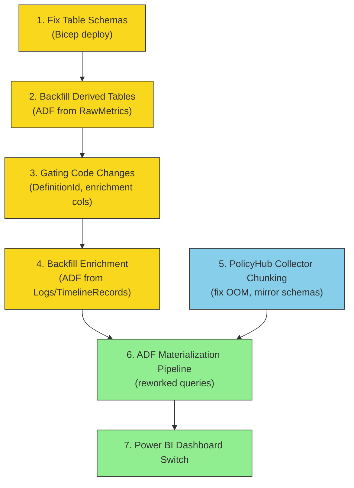
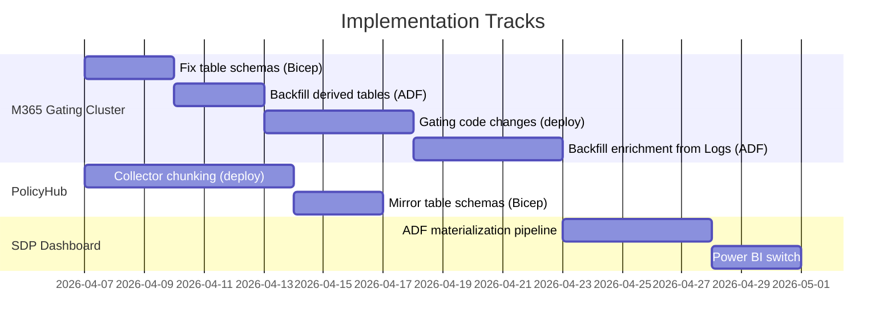

# Overview of Implementation Plan for SDP Compliance Dashboard

End-to-end plan to enable cumulative run information in the SDP Compliance dashboard by switching from OneBranch raw telemetry to PolicyHub normalized tables.

---

## Workstreams

### 1. Fix Gating Normalized Table Schemas (M365 Gating cluster)

**Status:** Designed, not implemented

- Restructure `PolicyVersionMetrics` — add PolicyRan, PolicyPassed, Data, MetaData (moved from RuleExecutionMetrics)
- Restructure `RuleExecutionMetrics` — add PolicyName, PolicyCompliantStatus; remove PolicyRan/PolicyPassed/Data/MetaData
- Update Kusto update policies in `KustoUpdatePolicies.bicep`
- Deploy via EV2 (Test -> PPE -> Prod)

**Detail:** [Enriching-Gating-Normalized-Tables.md — Phase 1](Enriching-Gating-Normalized-Tables.md)

### 2. Backfill Derived Tables from RawMetrics (M365 Gating cluster)

**Status:** ADF pipeline designed, not implemented

- Drop/recreate the 4 derived tables with corrected schemas
- Backfill from `RawMetrics` (60 days, ~516K source rows) using chunked `.set-or-append`
- PolicyVersionMetrics: ~55M rows (1-hour chunks); RuleExecutionMetrics: ~3M rows (1-day chunks)
- Re-enable update policies with corrected queries

**Detail:** [ADF-Backfill-Pipelines-Gating-Normalized-Tables.md — Pipeline 1](ADF-Backfill-Pipelines-Gating-Normalized-Tables.md)

### 3. Gating Service Code Changes

**Status:** Designed, not implemented

- **DefinitionId fix** — write `gatingRequestParams.DefinitionId` instead of `string.Empty`
- **ProjectName** — design decision pending (caller only sends GUID, not display name)
- **6 new enrichment columns** — Trainset, DeploymentType, Ring, Namespace, IsCosmicService, Ev2ServiceType
- **Ev2ServiceType derivation** — compute from `ReleaseStage.Ev2RSJobs`/`Ev2RAJobs` during SDP policy evaluation
- Deploy via EV2

**Detail:** [Enriching-Gating-Normalized-Tables.md — Phase 3](Enriching-Gating-Normalized-Tables.md)

### 4. Backfill Enrichment Columns from Logs (cross-cluster)

**Status:** ADF pipeline designed, not implemented

- Extract Ring, DeploymentType, Trainset, Namespace, IsCosmicService from OneBranch `Logs`
- Extract Ev2ServiceType from OneBranch `TimelineRecords`
- Extract DefinitionId (and ProjectName if available) from `PipelineRecords`
- Join with `RawMetrics` via staging table, update enrichment columns
- Re-run derived table backfill (step 2) to propagate into normalized tables

**Detail:** [ADF-Backfill-Pipelines-Gating-Normalized-Tables.md — Pipeline 2](ADF-Backfill-Pipelines-Gating-Normalized-Tables.md)

**Alternative:** Skip backfill, wait 60 days for new correctly-structured data to accumulate. Faster to ship but no historical data for 2 months.

### 5. PolicyHub Collector Flow with Chunking

**Status:** Design doc complete, code changes done (4 files, 651 tests passing), not yet deployed

- Fix OOM + silent data loss (remove `| take 100000`, add time-window chunking)
- `ChunkDuration: "PT1H"` for all Kusto data sources
- Row-based slicing as safety net for volume spikes within a chunk
- Per-chunk watermark advancement (self-healing on failure)
- Mirror new table schemas in PolicyHub `KustoTables.bicep`
- Deploy via EV2 (Test -> PPE -> Prod)

After this step, `PolicyHubAnalytics` has correct, complete replicas of all M365 Gating tables.

**Detail:** [PolicyHub_Collector_Flow_Query_Chunking_Design.docx](PolicyHub_Collector_Flow_Query_Chunking_Design.docx)

### 6. Reworked SDP Queries + ADF Materialization Pipeline

**Status:** Queries designed, ADF pipeline designed, not implemented

- Single parameterized daily-slice query reads from PolicyHub tables
- Eliminates all `Logs` parsing (regex, JSON), all `TimelineRecords` scanning, all `PipelineRecords` scoping
- Only remaining OneBranch dependencies: `BuildYamlSnapshot` (YAML bridge) and `ServiceTree` snapshots
- Grain: stage-run-policy (one row per CorrelationId x PolicyName)
- Time axis: `InsertedAt` (same across all derived tables — transactional update policies)
- ADF daily pipeline materializes via sliding 2-day window with delete-then-append
- **ServiceClassification dimension table** (separate, upserted daily — not recomputed):
  - `isCosmicService`, `Ev2ServiceType` — service-level aggregates with cumulative counters
  - `PipelineOnboarded` — pipeline-level aggregate computed at query time
  - Counters only grow — a service that had RA pipelines 90 days ago retains that classification even if those pipelines haven't run within the rolling window

**Detail:** [SDP-Cumulative-design-document.md](SDP-Cumulative-design-document.md), [Reworked Queries/](../Queries/Reworked%20Queries/)

### 7. Power BI Dashboard Switch

**Status:** Not started

- Point Power BI from current monolithic cross-cluster query to the materialized flat table
- Simple reads instead of 10+ left-outer join query with `set notruncation`

---

## Dependency Chain

**Legend:**
- Yellow = M365 Gating cluster work
- Blue = PolicyHub work
- Green = SDP pipeline + dashboard work

---

## Parallel Tracks

Steps 1-4 (Gating cluster) and step 5 (PolicyHub collector) can proceed **in parallel** — they have no dependency on each other until step 6.

---

## Key Risk

**Backfill vs Wait-60-Days:** The current `RuleExecutionMetrics` cannot be patched — `PolicyName` is missing so rows are indistinguishable. Phase 2 rebuilds the tables from `RawMetrics` (which has the full nested `RawGatingResult`). The alternative is skipping backfill and waiting 60 days for new correctly-structured data to fill the window. Backfill is more work but gives immediate historical coverage.

---

## Document References

| Document | What it covers |
|----------|---------------|
| [Enriching-Gating-Normalized-Tables.md](Enriching-Gating-Normalized-Tables.md) | Phases 1-4: schema fixes, code changes, backfill strategy |
| [ADF-Backfill-Pipelines-Gating-Normalized-Tables.md](ADF-Backfill-Pipelines-Gating-Normalized-Tables.md) | ADF pipeline definitions, stored functions, operational runbook |
| [PolicyHub_Collector_Flow_Query_Chunking_Design.docx](PolicyHub_Collector_Flow_Query_Chunking_Design.docx) | Phase 5: collector OOM fix, chunking design |
| [SDP-Cumulative-design-document.md](SDP-Cumulative-design-document.md) | Phase 6: 3-table architecture, ADF materialization pipeline |
| [Reworked Queries/](../Queries/Reworked%20Queries/) | Phase 6: reworked KQL queries using PolicyHub as source |
| [ADF-Pipeline-Design](ADF-Pipeline-Design) | Data risks and required protections for the daily pipeline |
