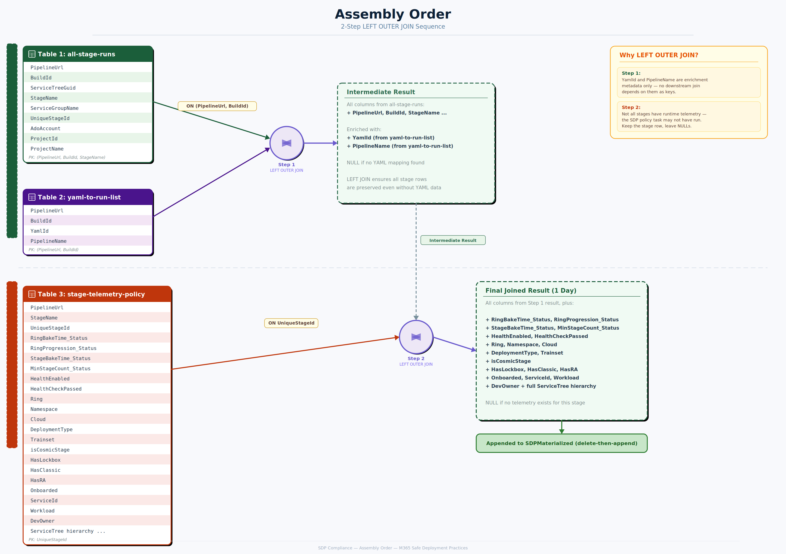
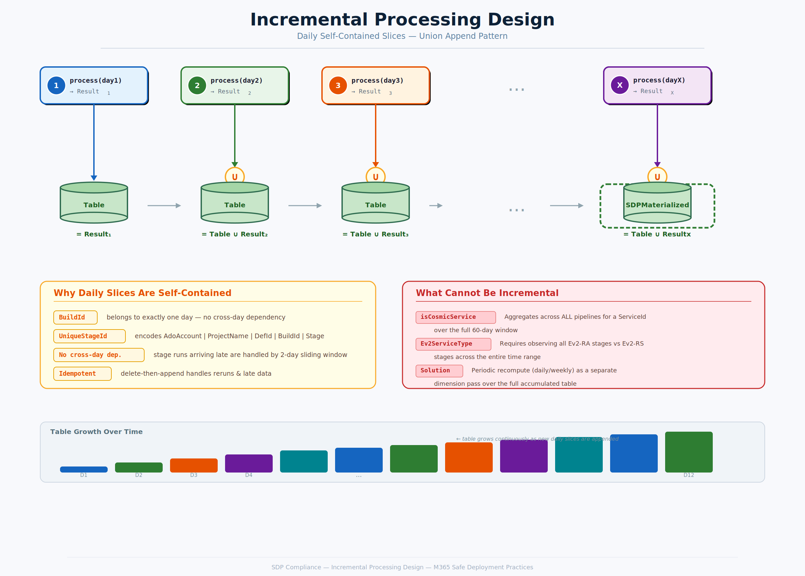
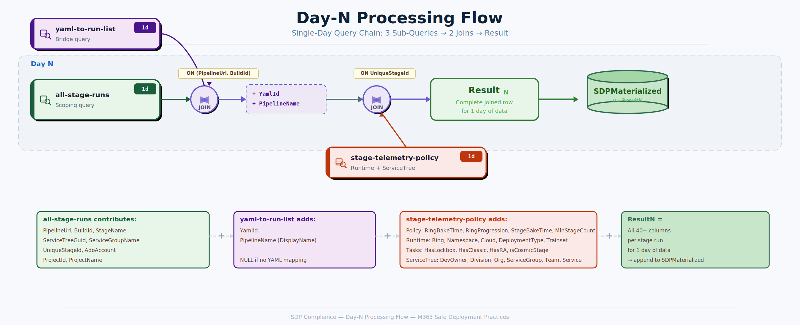
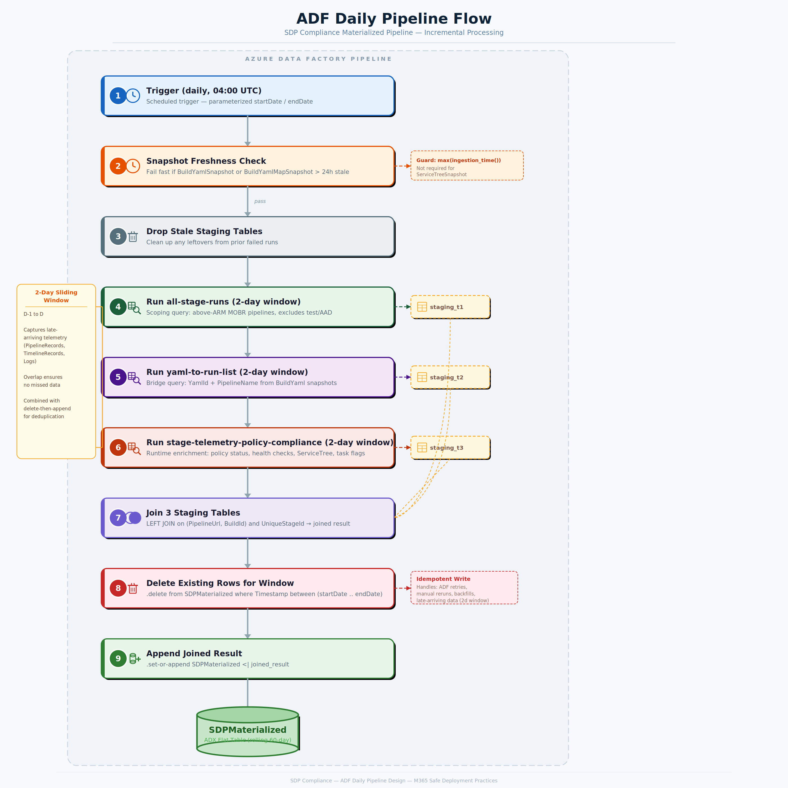

# SDP Compliance Materialized Pipeline — Design Document

---

## 1. Introduction

The SDP (Safe Deployment Practices) Compliance dashboard tracks deployment policy compliance for M365 services. It monitors whether pipeline stages follow required bake times, ring progression sequences, and minimum stage counts across ~6,200 pipeline definitions and ~210,000 runs over a rolling 60-day window.

The dashboard is powered by KQL queries that join data from multiple Azure Data Explorer (ADX) clusters at refresh time. This document proposes a new architecture that pre-materializes the joined data into a flat ADX table via a daily ADF pipeline, replacing the current query-time join approach.

The architecture diagram below shows the required data flow and enrichment layers:

---

## 2. Problem Statement

The current dashboard query:

- Joins data across **4 ADX clusters**: `servicetreepublic.westus`, `onebranchm365release.eastus`, `1es`, and `s360prodro`
- Performs **10+ left-outer joins** with `mv-expand`, `parse_json`, and cross-cluster calls
- Uses `set notruncation` and `set norequesttimeout` as workarounds
- Only retrieves the **latest run** per pipeline (via `arg_max`) due to scale constraints

Phase 2 requires **all historical runs** (~210K runs, ~1.9M stage-runs over 60 days), which exceeds ADX limits:

| Limit | Threshold | Impact |
|---|---|---|
| Join memory budget | 5 GB default, 30 GB max | Error `80DA0001` — exceeded by 10+ joins on ~1.9M rows |
| Cross-cluster subquery truncation | 64 MB per subquery | May apply to remote calls depending on query shape; mitigated by local snapshot tables (see optimizations 3-4) |
| Interactive query timeout | 4 min default, 1 hr max | ~252s ceiling after all optimizations |

### Optimization Attempts

8 progressive optimizations were applied to the all-runs query. Each built on the previous, and all resulted in the same ~252-second timeout:

| # | Optimization | Result |
|---|---|---|
| 1 | Rewrote query for all runs (stage x run expansion) | Timeout ~252s |
| 2 | Added `set servertimeout = 1h` | Timeout ~252s |
| 3 | Replaced all cross-cluster calls to `1es` with local snapshots (10 calls eliminated) | Timeout |
| 4 | Replaced cross-cluster calls to `servicetreepublic` with local snapshots (2 calls eliminated) | Timeout |
| 5 | Replaced explicit same-cluster references with local table names | Timeout |
| 6 | Added `materialize()` to cache intermediate result | Timeout |
| 7 | Added `hint.strategy=shuffle` on 3 heaviest joins | Timeout |
| 8 | Filtered pipeline info to only MOBR pipelines before joins | Timeout |

**Conclusion:** The query's complexity (10+ left-outer joins on ~1.9M stage-run rows) fundamentally exceeds ADX's interactive query execution limits. A different architecture is required.

---

## 3. Goals

1. Materialize all historical stage-run data into a single pre-joined flat ADX table
2. Support daily incremental processing (1-day slices appended to the table)
3. Use local snapshot tables to avoid cross-cluster overhead and reduce query complexity
4. Serve the PowerBI dashboard with simple read queries against the materialized table

---

## 4. Design Requirements

| Requirement | Constraint |
|---|---|
| Data volume | ~1.9M stage-run rows over 60 days |
| Incremental support | Daily append of new data without reprocessing full window |
| Late-arriving data | Must handle telemetry arriving up to 24-48 hours late |
| Idempotency | Reruns and retries must not create duplicate rows |
| Memory limits | Each sub-query must stay within ADX per-operator memory budget |
| Timeout limits | Each execution must complete within ADX management command timeout |
| Correctness | Join results must be identical to running the full query on X days of data |

---

## 5. Current Design

The current query (`Current state of SDP dashboard query.md`) is a single monolithic KQL script that:

1. Queries `servicetreepublic.westus` (cross-cluster) for ServiceTree hierarchy
2. Queries `onebranchm365release.eastus` (local) for PipelineRecords, TimelineRecords
3. Queries `1es` (cross-cluster, 10+ calls) for BuildYaml and BuildYamlMap
4. Queries `s360prodro` (cross-cluster) for SDP action items
5. Performs 10+ left-outer joins to combine all dimensions
6. Returns only the latest run per pipeline via `arg_max(Id, *)`

### Why the Monolithic Query Cannot Be Incrementally Processed

The monolithic query cannot be partitioned into daily slices because:

- **Joins are interdependent.** Intermediate results feed into downstream joins — stage ring analysis feeds into pipeline onboarding, which feeds into service classification. The entire chain must execute in one pass.
- **Service-level classification requires the full window.** `isCosmicService` and `Ev2ServiceType` aggregate across ALL pipelines for a service. Processing day 1 alone would misclassify services that have pipelines running on other days.
- **"Latest YAML" retroactive interpretation.** The old query uses `arg_max(BuildId, YamlId)` to get the single latest YAML per pipeline, then applies it to all historical runs. A YAML change retroactively alters all rows. This global dependency prevents day-by-day processing.
- **Stage properties derived from YAML at query time.** Ring, namespace, cloud, and task flags were extracted from YAML definitions (not runtime data), creating a dependency on the full YAML history.

---

## 6. In Scope

- Decomposition of the monolithic query into 3 modular sub-queries
- Schema design for each sub-table with defined keys and join relationships
- ADF daily pipeline for incremental materialization
- Initial backfill strategy (chunked by week)
- Deduplication and late-data handling

## 7. Out of Scope

- **s360prodro SDP action items / wave classification** — can be added as a future enrichment join (small cross-cluster dataset)
- PowerBI report redesign
- Materialized view design (e.g., `SDP_LatestRun`) — covered separately
- Service-level classification tables (isCosmicService, Ev2ServiceType) — addressed as a periodic recompute, not part of the daily incremental

---

## 8. Design Proposal

### 8.1 Why Decompose into 3 Tables

The key insight is that while the monolithic query cannot be partitioned by day, **independent sub-queries can**. By decomposing the monolith into sub-queries where each is self-contained per day, we enable incremental processing:

- Each sub-query reads from a single data source (PipelineRecords, BuildYamlMapSnapshot, or Logs/TimelineRecords)
- All join keys are scoped to a single run — a BuildId belongs to exactly one day
- No sub-query needs data from other days to produce correct output for its day
- Daily results can be joined and appended iteratively: `Table = Table ∪ Result_N`

This is impossible with the old monolithic query because its joins create cross-day dependencies (e.g., service classification aggregates across all days).

### 8.2 The 3-Table Architecture

#### Table 1: all-stage-runs (Scoping)

Defines the universe of in-scope stages. Filters to above-ARM MOBR pipelines, excluding test accounts, AAD, and below-ARM pipelines. The `exemptedPipelines` filter must also be applied here (or as a post-join filter) to exclude known-exempt pipelines from compliance reporting.

| Column | Type | Description |
|---|---|---|
| PipelineUrl | string | ADO pipeline URL |
| BuildId | long | Run/build identifier |
| ServiceTreeGuid | string | Effective ServiceId for this stage |
| StageName | string | Deployment stage name |
| ServiceGroupName | string | Service group from PipelineRecords |
| UniqueStageId | string | Composite key |
| AdoAccount | string | ADO account name |
| ProjectId | string | ADO project GUID |
| ProjectName | string | ADO project display name |

**Primary Key:** `(PipelineUrl, BuildId, StageName)` / `UniqueStageId`

#### Table 2: yaml-to-run-list (Bridge + Pipeline Name)

Maps each run to its YAML definition and pipeline display name. Enrichment only — no downstream join depends on YamlId.

| Column | Type | Description |
|---|---|---|
| PipelineUrl | string | ADO pipeline URL |
| BuildId | long | Run/build identifier |
| YamlId | string | YAML definition identifier from BuildYamlMapSnapshot |
| PipelineName | string | Pipeline display name from BuildYamlSnapshot (Index == 0) |

**Primary Key:** `(PipelineUrl, BuildId)`

#### Table 3: stage-telemetry-policy-compliance (Runtime Enrichment + ServiceTree)

All runtime data: policy compliance, health checks, stage properties, task classification flags, ServiceTree enrichment, and stage onboarding status. Sourced from Logs, TimelineRecords, PipelineRecords (via GetVersionInfo), ServiceTreeHierarchySnapshot, and ServiceTreeSnapshot.

| Column | Type | Description |
|---|---|---|
| PipelineUrl | string | ADO pipeline URL |
| StageName | string | Stage name |
| UniqueStageId | string | Composite key |
| RingBakeTime_Status | int | Policy status (1=Pass, 2=Fail, 3=NotRun, 4=Missing) |
| RingProgression_Status | int | Policy status |
| StageBakeTime_Status | int | Policy status |
| MinStageCount_Status | int | Policy status |
| HealthEnabled | int | 1 if health-check-v1 exists |
| HealthCheckPassed | bool | true if all health checks passed |
| Ring | string | Deployment ring (from runtime MOBR/Cosmic logs) |
| Namespace | string | COSMIC namespace or "Non-Cosmic" |
| Cloud | string | Target cloud environment |
| DeploymentType | string | Normal / Emergency / GlobalOutage |
| Trainset | string | Trainset ID |
| isCosmicStage | int | 1 if COSMIC ring data exists |
| HasLockbox | int | 1 if Lockbox task present (from TimelineRecords runtime data) |
| HasClassic | int | 1 if ExpressV2Internal task present (from TimelineRecords runtime data) |
| HasRA | int | 1 if Ev2RARollout task present (from TimelineRecords runtime data) |
| Onboarded | int | 1 if Ring is non-empty AND in workload's AllowedRings; 0 otherwise |
| ServiceId | string | ServiceTree GUID (from GetVersionInfo) |
| Workload | string | Computed workload grouping (from ServiceTree hierarchy) |
| DevOwner | string | Dev owner from ServiceTree |
| DivisionName | string | Division from ServiceTree hierarchy |
| OrganizationName | string | Organization from ServiceTree hierarchy |
| ServiceGroupName | string | Service group from ServiceTree hierarchy |
| TeamGroupName | string | Team group from ServiceTree hierarchy |
| ServiceName | string | Service name from ServiceTree hierarchy |

**Primary Key:** `UniqueStageId`

**Notes:**
- HasLockbox, HasClassic, and HasRA are sourced from TimelineRecords (runtime), not YAML definitions. Runtime detection reflects what actually executed.
- Onboarded is computed using ServiceTree enrichment (ServiceId → Workload) and a ringworkload datatable (Workload → AllowedRings). Both are resolved within this query.

### 8.3 Assembly Order

**Step 1** is left outer because YamlId and PipelineName are purely enrichment metadata — no downstream table uses them as join keys.
**Step 2** is left outer because not all stages have runtime telemetry — the SDP policy task may not have run, or log entries may be missing. Keep the stage row, leave enrichment columns NULL.

### 8.4 Incremental Processing Design

All 3 tables support daily incremental processing. Each day's slice is self-contained:

Where `process(dayN)` is:

**Why this works:**
- `(PipelineUrl, BuildId)` — a BuildId belongs to exactly one day
- `UniqueStageId` — encodes AdoAccount, ProjectName, DefinitionId, BuildId, StageName — fully identifies one stage in one run on one day
- A run that happened on Tuesday never needs data from Wednesday's slice

**What cannot be done incrementally:**
- **Service-level classification** (isCosmicService, Ev2ServiceType) — aggregates across ALL pipelines for a ServiceId over the full window. Requires a periodic recompute pass over the full accumulated table.

---

## 9. ADF Pipeline Design

### Daily Pipeline Flow

### Key Risk Mitigations

**Late-arriving data:**
Telemetry tables (PipelineRecords, TimelineRecords, Logs) ingest asynchronously. A run on Day N may appear on Day N+1. Each daily execution processes a sliding **2-day** window (D-1 to D), overlapping with the previous run. A 2-day window was chosen under the assumption that the vast majority of late-arriving data lands within 24 hours; the extra day of overlap keeps costs manageable while covering realistic ingestion delays. Combined with delete-then-append logic, this ensures late data is captured without duplication. However, this window will be adjusted if we notice significant telemetry arriving after 48 hours.

**Deduplication:**
ADF retries, manual reruns, or backfills can execute the same day multiple times. The pipeline uses a delete-then-append strategy: first delete all existing rows for the reprocessing window (`.delete from SDPMaterialized where Timestamp between (startDate .. endDate)`), then append the fresh joined result via `.set-or-append`. This ensures idempotent writes and allows the sliding window to update existing rows with corrected data.

**Backfill:**
Initial 60-day backfill is chunked into weekly windows (~220K stage-runs per chunk) to stay within ADX memory limits. At ~750 bytes/row uncompressed, 220K rows ≈ 165 MB per chunk, well within the recommended 1 GB per `.set-or-append` operation. Each chunk is a parameterized stored function call: `SDP_BackfillChunk(startDate, endDate)`.

**Service classification instability:**
`isCosmicService` and `Ev2ServiceType` depend on observing all pipelines across the full time range. These are computed as a separate periodic dimension recompute (daily or weekly), not as part of the daily fact load. This can be done over the full accumulated table since it's a global aggregation, not an incremental append.

**Partial write failures:**
Results are written to a staging table first, then applied to the final fact table via delete-then-append (idempotent replace). ADX does not support transactions, so the delete and append are separate operations. If the pipeline fails mid-write, the staging table is dropped on retry — no partial state persists, and the next run's delete-then-append recovers automatically.

### Cross-Midnight Runs (RunDate)

Pipeline runs that span midnight would appear in two daily windows if filtered naively by Timestamp. To prevent this, a canonical `RunDate` is assigned per BuildId based on the earliest `PipelineRecords.Timestamp` for that BuildId. All 3 sub-queries filter on this RunDate rather than raw event timestamps, ensuring each run is processed exactly once in the window corresponding to its start.

### Rollback / Cleanup Strategy

At pipeline start, drop any staging tables left over from prior failed runs before writing new ones. This prevents stale intermediate data from contaminating the current execution.

### Other Considerations

- **Parameterized date ranges:** ADF passes explicit `startDate`/`endDate` parameters. Queries never use `now()` to avoid clock skew.
- **Snapshot freshness:** The pipeline checks `max(ingestion_time())` on snapshot tables (Not required for serviceTreeSnapshot) and fails fast if any snapshot is older than 24 hours.
- **Consecutive failures:** If the pipeline fails for 2+ consecutive days, a manual backfill is needed for the gap.

---

## 10. Risks and Dependencies

| Risk | Mitigation |
|---|---|
| Snapshot tables stale (BuildYamlSnapshot, BuildYamlMapSnapshot) | Freshness check at pipeline start; fail fast if > 24h stale .er assumes stable pipeline classification | Compute once, reuse. Pipelines don't flip between above/below ARM day-to-day |
| 2+ consecutive pipeline failures create data gaps | Manual backfill using SDP_BackfillChunk for affected date range |
| Type mismatch: BuildId (long) vs Id (string) in policy-compliance | Join on UniqueStageId (string) avoids the mismatch |

---

## 11. Future Add-ons

**s360prodro SDP action items:** Wave classification (e.g., "Wave 8") from `cluster('s360prodro').database('service360db')` can be added as an additional left-outer join enrichment on PipelineUrl. Small dataset, minimal cross-cluster overhead.

---

## 12. Alternatives Considered

| Approach | Reason for Rejection |
|---|---|
| In-query optimization | 8 attempts, all timed out at ~252s. The join scale fundamentally exceeds ADX interactive limits. |
| Spark / Fabric Lakehouse | Requires language rewrite (KQL → PySpark), new infrastructure provisioning. Overkill for ~570 MB compressed data. |
| ADX Update Policies | Designed for per-record enrichment, not global reconciliation across multiple asynchronous sources. |
| ADX Continuous Export | Targets external storage (ADLS, Blob), cannot write to another ADX table. |
| Daily windowing on the monolithic query | Joins are interdependent — service classification needs all days, "latest YAML" retroactively affects all runs. Cannot partition by day. |
| Full replace daily | Correct but expensive — recomputes entire 60-day window daily (~7.6M rows). Not needed when only 1 day of new data arrives. |

## 12. Open Questions

1. Exact ADF scheduling time and retry policy
2. Retention period for the materialized table (e.g., rolling 90 days, or full history)
3. Whether to implement a weekly full-rebuild consistency check

---

## 14. References

| Resource | Description |
|---|---|
| `schema.md` | 3-table schema reference with keys, joins, and incremental processing analysis |
| `all-stage-runs.md` | Scoping sub-query |
| `yaml-to-run-list.md` | YAML bridge sub-query |
| `stage-telemetry-policy-compliance.md` | Runtime enrichment sub-query |
| `Current state of SDP dashboard query.md` | Old monolithic cross-cluster query |
| `ADF-Pipeline-Design.md` | ADF data risks and required protections |
| `SDP Cumulative Architecture Plan.png` | Architecture diagram |
